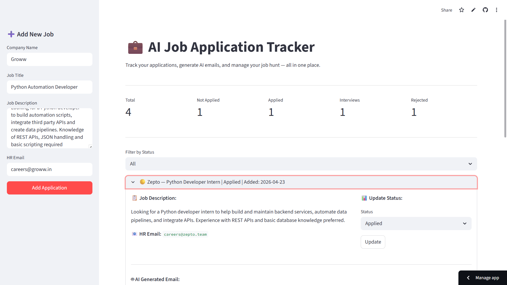

# 💼 AI Job Application Tracker

A Python-based automation tool that helps job seekers track applications, 
generate personalized cold emails using AI, and send them automatically via Gmail.

> Built with Python, Streamlit, Groq AI (LLaMA 3.3), SQLite, and Gmail SMTP


---

## 🚀 Live Demo
[Click here to view the live app](https://ai-job-tracker-ayush.streamlit.app)

---

## 📸 Screenshot


---

## ✨ Features

- **Add & Track Applications** — Store company, job title, description and HR email
- **AI Email Generator** — Auto generates personalized cold emails using LLaMA 3.3 via Groq API
- **Application Status Tracking** — Mark as Not Applied / Applied / Interview / Rejected
- **Gmail Auto-Send** — Send emails directly from the app via Gmail SMTP
- **Email Scheduler** — Schedule emails to be sent automatically at a specific date and time
- **Stats Dashboard** — See total applications, interviews, rejections at a glance
- **Filter by Status** — Quickly view applications by current stage

---

## 🛠️ Tech Stack

| Layer | Technology |
|---|---|
| Frontend/UI | Streamlit |
| AI/LLM | Groq API (LLaMA 3.3 70B) |
| Database | SQLite |
| Email Sending | Gmail SMTP |
| Scheduling | Python Schedule library |
| Environment | Python-dotenv |

---

## ⚙️ Setup & Installation

1. **Clone the repository:**
```bash
   git clone https://github.com/Aayushxdd09/ai-job-tracker.git
   cd ai-job-tracker
```

2. **Install dependencies:**
```bash
   pip install -r requirements.txt
```

3. **Set up environment variables:**
   - Copy `.env.example` to `.env`
   - Fill in your credentials:
```
     GROQ_API_KEY=your_groq_api_key_here
     SENDER_EMAIL=your_email@gmail.com
     SENDER_PASSWORD=your_gmail_app_password
```
   - Get Groq API key free at: https://console.groq.com
   - Get Gmail App Password at: myaccount.google.com/apppasswords

4. **Run the app:**
```bash
   streamlit run app.py
```

5. **Run the email scheduler** (separate terminal):
```bash
   python scheduler.py
```

---

## 📁 Project Structure

```
ai-job-tracker/
│
├── app.py              # Streamlit dashboard
├── database.py         # SQLite database operations
├── ai_email.py         # Groq AI email generation
├── email_sender.py     # Gmail SMTP sending
├── scheduler.py        # Automatic email scheduler
├── requirements.txt    # Dependencies
├── .env.example        # Environment variables template
└── README.md
```

---

## 🔒 Security Notes

- Never commit your `.env` file — it's in `.gitignore`
- Use Gmail App Password, not your real Gmail password
- API keys are loaded via environment variables only

---

## 👤 Author

**Ayush Soni**  
📧 ayushsoni8120@gmail.com  
🔗 [GitHub](https://github.com/Aayushxdd09)